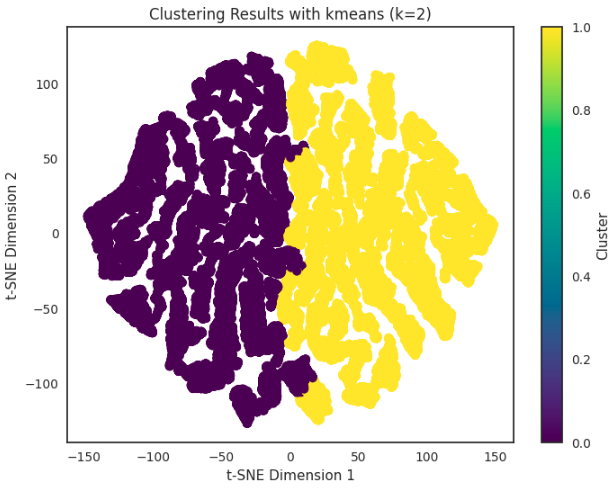
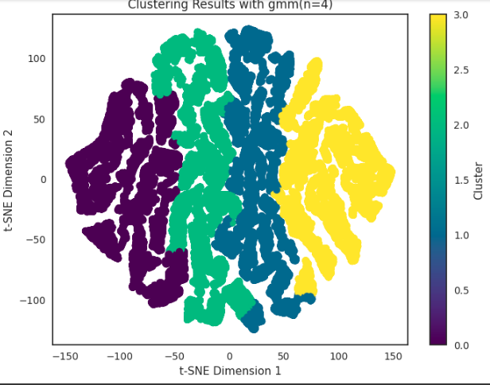
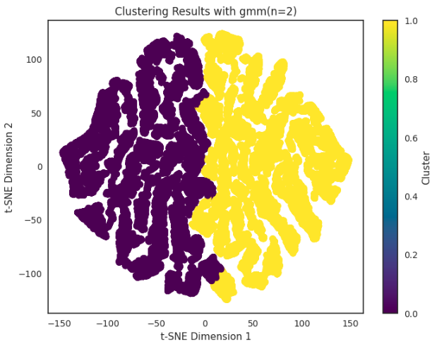

# supermarket-dataset
An analysis on Supermarket dataset using different using unsupervised machine learning algorithms.

# Dataset

The dataset has 2019501 data points with 12 features. The following is
explanation of each feature:

-   order-id (A unique number to identity the order)

-   user-id - (A unique number to identify the user)

-   order-number -- (Number of the order)

-   order-dow -- (Day of the Week the order was made)

-   order-hour-of-day -- (Time of the order)

-   days-since-prior-order - (History of the order)

-   product-id -- (Id of the product)

-   add-to-cart-order -- (Number of items added to cart)

-   reordered -- (If the reorder took place)

-   department-id - (Unique number allocated to each department)

-   department -- (Names of the departments)

-   product-name -- (Name of the products)

# EDA

At first, a simple analysis is performed on the data. This can be
divided into two parts; Analysing based on time, and analysing based on
products and basket.

## Initial works

Number of unique values for each of the following features:

-   user-ids: 10527

-   order-ids: 200000

-   product-ids: 134

-   department-ids: 21

The statistical properties of each column have been computed and are
available in the notebook.\
There are missing values in the column "days-since-prior-order" they are
replaced by 0 because negative values for this feature are meaningless.

## Analysis based on products and basket

Important information can be gained from the data and the mentioned
plots:

-   Frequency of different basket sizes
    ([1](#fig:basket_size_freq){reference-type="ref"
    reference="fig:basket_size_freq"}).

    {#fig:basket_size_freq
    width="90%"}

-   Average number of products in basket is 8

-   Top 5 popular products across all departments
    ([2](#fig:Top 5 popular products){reference-type="ref"
    reference="fig:Top 5 popular products"})

    {#fig:Top 5 popular products width="90%"}

-   Top 5 popular departments
    ([3](#fig:Top 5 popular departments){reference-type="ref"
    reference="fig:Top 5 popular departments"})

    {#fig:Top 5 popular departments
    width="90%"}

-   The most popular product of each department is computed in the
    notebook.

## Information based on time

Important information can be gained from the data and the mentioned
plots:

-   Number of orders based on day hours
    ([4](#fig:orderhour){reference-type="ref"
    reference="fig:orderhour"})

    {#fig:orderhour width="90%"}

-   Heatmap of orders in week days and hours of the day
    ([5](#fig:heatmap){reference-type="ref" reference="fig:heatmap"})

    {#fig:heatmap width="90%"}

    It can be found that the busiest hours are from 10 to 16 and the
    busiest days are Mondat and Tuesday

It can be found that the busiest hours are from 10 to 16 and the busiest
days are Mondat and Tuesday

# Dimensionality reduction and sampling

Because of the high size of data, we use uniformly sample 0.025 of
dataset.\
We use PCA for dimension rduction before performing clutering
algorithms, For standard scaled sample we don't use PCA because it can't
summarize the properties of data well (figure
[7](#fig:pcacompfindstandard){reference-type="ref"
reference="fig:pcacompfindstandard"}) and t-SNE for visualizations based
on examinations, 2 dimension is chosen for dimension reductioin. The
figure [6](#fig:pcacompfindsample){reference-type="ref"
reference="fig:pcacompfindsample"} shows the reason.

{#fig:pcacompfindsample width="90%"}

{#fig:pcacompfindstandard width="90%"}

# Clustering

For kmeans, according to elbow method, visualization of checking inertia
and also, silhouette score for different numbers of clusters are in
figure [8](#fig:kelbow){reference-type="ref" reference="fig:kelbow"}
(based on sample data)

{#fig:kelbow width="90%"}

The algorithms and their properties and silhouette score are as follows:

-   4means on sample data : 0.547 (figure
    [9](#fig:4msam){reference-type="ref" reference="fig:4msam"})

    ![\]](images/4meansSmple.PNG){#fig:4msam width="90%"}

    4means on sample data []{#fig:4msam label="fig:4msam"}

-   2means on sample data : 0.617 (figure
    [10](#fig:2msam){reference-type="ref" reference="fig:2msam"})

    {#fig:2msam
    width="90%"}

-   2means on dimension reduced sample data (PCA with 2 components) :
    0.618 (figure [11](#fig:2mpca){reference-type="ref"
    reference="fig:2mpca"})

    {#fig:2mpca width="90%"}

-   Gaussian mixture model with 4 components on dimension reduced sample
    data : 0.548 (figure [12](#fig:gmm4){reference-type="ref"
    reference="fig:gmm4"})

    {#fig:gmm4
    width="90%"}

-   Gaussian mixture model with 2 components on dimension reduced sample
    data : 0.548 (figure [13](#fig:gmm2){reference-type="ref"
    reference="fig:gmm2"})

    {#fig:gmm2
    width="90%"}

# Conclusion

In this work, based on information, gained from EDA part, we can find
that first 2 days of the week and hours between 10 AM and 4 PM, are the
busiest times. Also we can find some information about basket size and
items and popularity of products and departments, so based on that, the
suggestions to customers can be formulated, and the market can know
amount of products to be provided. Based on EDA and clustering the
market can recognize:

-   amount of products to be provided

-   how busy is the market in each day and each hour

-   the suitable suggestions for each customer based on their purchases.
    The products in the same cluster with the purchased item can be
    suggested to the customer.

